# Software Requirements Specification (SRS)
## Outfit.ai — AI-Powered Digital Wardrobe & Outfit Recommendation Platform

**Document Version:** 1.0
**Status:** Draft for Engineering Implementation
**Prepared for:** AI Coding Agents (Cursor / Claude Code / GitHub Copilot / Gemini CLI) and Engineering Team
**Classification:** Internal — Product Engineering

---

## Document Control

| Field | Value |
|---|---|
| Product Name | Outfit.ai |
| Document Type | Software Requirements Specification |
| Target Release | MVP v1.0 |
| Owner | Product Engineering |
| Audience | Backend Engineers, Frontend Engineers, AI/ML Engineers, DevOps, QA, AI Coding Agents |

---

## Table of Contents

1. [Introduction](#1-introduction)
2. [Overall Description](#2-overall-description)
3. [Assumptions & Constraints](#3-assumptions--constraints)
4. [System Architecture](#4-system-architecture)
5. [Tech Stack](#5-tech-stack)
6. [Functional Requirements (MVP Features)](#6-functional-requirements-mvp-features)
7. [Database Design](#7-database-design)
8. [REST API Specification](#8-rest-api-specification)
9. [AI Module Design](#9-ai-module-design)
10. [Weather Integration](#10-weather-integration)
11. [Recommendation Engine](#11-recommendation-engine)
12. [User Flows](#12-user-flows)
13. [UI/UX Requirements](#13-uiux-requirements)
14. [Non-Functional Requirements](#14-non-functional-requirements)
15. [Security Requirements](#15-security-requirements)
16. [Testing Strategy](#16-testing-strategy)
17. [Deployment & DevOps](#17-deployment--devops)
18. [Folder Structure](#18-folder-structure)
19. [Configuration & Environment Variables](#19-configuration--environment-variables)
20. [Future Roadmap](#20-future-roadmap)
21. [Acceptance Criteria Summary](#21-acceptance-criteria-summary)
22. [Appendix](#22-appendix)

---

## 1. Introduction

### 1.1 Purpose

This Software Requirements Specification (SRS) defines the complete functional, technical, and non-functional requirements for **Outfit.ai**, an AI-powered digital wardrobe and outfit recommendation platform. This document is written to be directly consumable by an AI coding agent (e.g., Cursor, Claude Code, GitHub Copilot, Gemini CLI) to scaffold and implement the application with minimal additional clarification, as well as by human engineers for planning, estimation, and code review.

### 1.2 Scope

Outfit.ai allows a user to:

- Create an account and manage a profile.
- Upload photos of clothing items into a digital wardrobe.
- Have each item automatically analyzed by an AI vision model to extract category, color, formality, season, and tags.
- Receive AI-generated outfit recommendations based on real-time weather, occasion, wardrobe inventory, personal style, and color harmony rules.
- Save, favorite, and review a history of recommended/worn outfits.
- View a personal dashboard with wardrobe statistics and usage insights.

This document scopes the **MVP (v1.0)** in full detail and outlines **v2/v3/long-term** features in the [Future Roadmap](#20-future-roadmap) at a lower level of detail (explicitly out of scope for MVP implementation).

### 1.3 Intended Audience

- Backend engineers (FastAPI/Python)
- Frontend engineers (Next.js/React/TypeScript)
- AI/ML engineers (vision model integration, recommendation logic)
- DevOps/SRE (Docker, CI/CD, cloud deployment)
- QA engineers
- AI coding agents performing autonomous or semi-autonomous implementation

### 1.4 Definitions, Acronyms, Abbreviations

| Term | Definition |
|---|---|
| SRS | Software Requirements Specification |
| MVP | Minimum Viable Product |
| JWT | JSON Web Token |
| ORM | Object-Relational Mapping |
| CRUD | Create, Read, Update, Delete |
| RBAC | Role-Based Access Control |
| TTL | Time To Live (cache expiry) |
| DTO | Data Transfer Object |
| API | Application Programming Interface |
| CORS | Cross-Origin Resource Sharing |
| CSRF | Cross-Site Request Forgery |
| XSS | Cross-Site Scripting |

### 1.5 Priority Legend

Every feature and requirement in this document is tagged with one of the following priorities:

- 🔴 **Must Have (M)** — Required for MVP launch; system is not viable without it.
- 🟡 **Should Have (S)** — Important but MVP can launch without it in a degraded mode.
- 🟢 **Nice to Have (N)** — Enhances experience; deferred without blocking launch.

---

## 2. Overall Description

### 2.1 Product Perspective

Outfit.ai is a new, standalone, cloud-native SaaS web application. It is a three-tier system:

1. **Presentation tier** — Next.js/React/TypeScript SPA-style web app.
2. **Application tier** — FastAPI backend exposing versioned REST APIs, containing business logic, AI orchestration, and recommendation engine.
3. **Data tier** — PostgreSQL relational database, Cloudinary for image object storage, and a caching layer for weather data.

### 2.2 Product Functions (Summary)

| Function Area | Summary |
|---|---|
| Authentication | Secure sign-up/login/logout with JWT, password hashing, profile management |
| Wardrobe Management | CRUD for clothing items with image upload, search, and filter |
| AI Image Analysis | Automatic clothing categorization, color/formality/season detection, tag suggestion |
| Weather Integration | Real-time weather fetch with caching, weather-aware outfit logic |
| Recommendation Engine | Rule-based + AI-assisted outfit generation using multiple signals |
| Saved Outfits | Save, favorite, delete, and view history of outfits |
| Dashboard | Aggregated wardrobe statistics and insights |

### 2.3 User Classes and Characteristics

| User Class | Description | Technical Proficiency |
|---|---|---|
| End User (Primary) | Registers, uploads wardrobe, gets recommendations | Low–Medium |
| Admin (Internal, Post-MVP) | Manages platform, moderates content, views analytics | Medium–High |
| AI Coding Agent | Consumes this SRS to implement the system | N/A |

### 2.4 Operating Environment

- **Client:** Modern evergreen browsers (Chrome, Firefox, Safari, Edge), responsive down to mobile viewport (360px width).
- **Server:** Linux containers (Docker) deployed on Render or AWS (ECS/EC2).
- **Database:** Managed PostgreSQL (Render Postgres, AWS RDS, or Supabase-compatible).
- **Third-Party Services:** Cloudinary (image storage/CDN), OpenWeather API (weather), Gemini Vision API (clothing image analysis).

### 2.5 Design and Implementation Constraints

- Must use the tech stack defined in [Section 5](#5-tech-stack); substitutions require explicit sign-off.
- All secrets must be managed via environment variables — never hardcoded.
- All AI calls must have a fallback path (see [Section 9.5](#95-ai-failure-handling--fallback-strategy)).
- All monetary/paid third-party API calls (Gemini Vision, OpenWeather paid tiers) must be rate-limited and cached where possible to control cost.

### 2.6 User Documentation

The system will ship with:
- In-app onboarding tooltips (post-MVP, 🟢).
- API documentation (OpenAPI/Swagger, auto-generated by FastAPI) (🔴).
- A `README.md` with local setup instructions (🔴).

---

## 3. Assumptions & Constraints

### 3.1 Assumptions

1. Users have a modern smartphone or camera to take reasonably clear photos of clothing items on a plain-ish background.
2. Users have an internet connection sufficient for image uploads (assume avg. image size 1–5MB).
3. OpenWeather API free/developer tier is sufficient for MVP traffic volumes (< 1,000 calls/day); paid tier upgrade path exists.
4. Gemini Vision (or equivalent multimodal LLM, e.g., GPT-4V, Claude vision) is available via API key and can classify clothing attributes from a single image with acceptable accuracy (≥80% category accuracy assumed for MVP acceptance).
5. Single-region deployment is acceptable for MVP; multi-region is a v2+ concern.
6. Users primarily interact in English for MVP; i18n is out of scope for MVP.
7. Wardrobe sizes for MVP users are assumed to be in the 10–300 item range; extreme-scale wardrobes (10,000+ items/user) are out of scope for MVP performance targets.

### 3.2 Constraints

1. Budget-conscious use of paid AI/weather APIs — must implement caching and request batching.
2. MVP timeline assumes a small team (1–4 engineers) or an AI coding agent executing over a period of weeks, not months.
3. No native mobile app in MVP (responsive web only).
4. No payment/subscription system in MVP (deferred to Future Roadmap).

### 3.3 Dependencies

| Dependency | Type | Risk if Unavailable |
|---|---|---|
| Gemini Vision API | External AI | Falls back to manual tagging (see 9.5) |
| OpenWeather API | External Data | Falls back to cached/last-known weather or manual occasion-only recommendations |
| Cloudinary | External Storage | Upload blocked; must display clear error, retry queue |
| PostgreSQL | Internal Infra | Full outage — highest severity |

---
## 4. System Architecture

### 4.1 High-Level Architecture Diagram

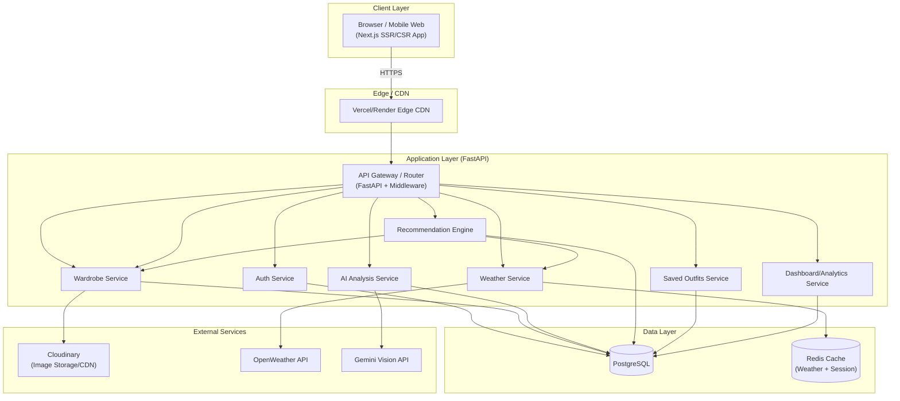

### 4.2 Layered Backend Architecture

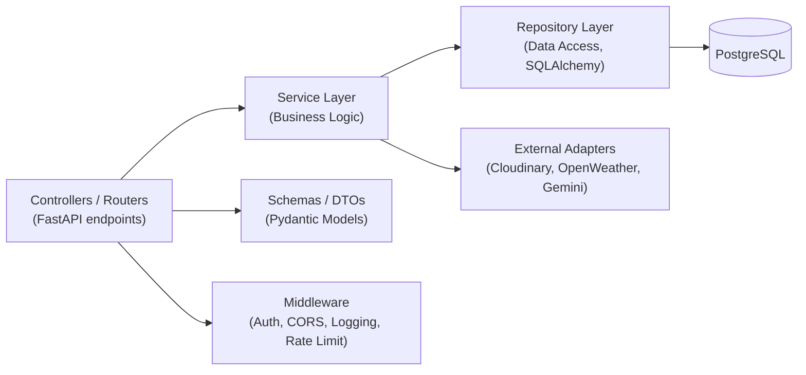

**Architectural Principles:**

- **Separation of Concerns:** Controllers (routers) never talk to the database directly — always through services.
- **Repository Pattern:** All SQL/ORM access is isolated in repository classes, enabling easier testing via mocking.
- **Dependency Injection:** FastAPI's `Depends()` system is used to inject DB sessions, current user, and service instances into route handlers.
- **DTO Boundary:** Pydantic schemas validate all inbound/outbound data; ORM models never leak directly to API responses.
- **Stateless Services:** All backend services are stateless; session state lives in JWT + PostgreSQL, enabling horizontal scaling.

### 4.3 Frontend Architecture

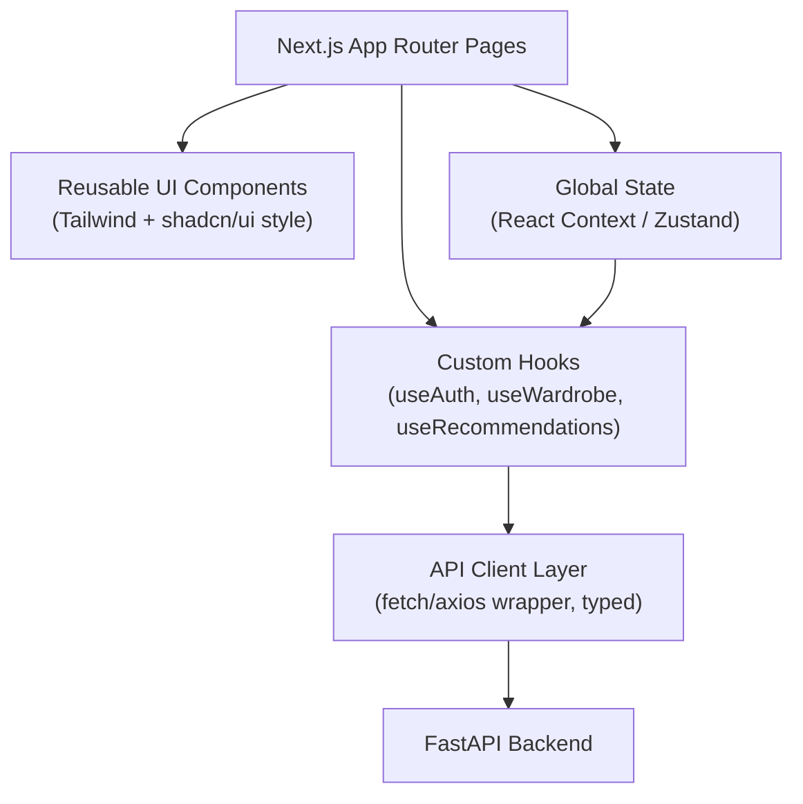

- **Routing:** Next.js App Router (`/app` directory), file-based routing.
- **State Management:** Zustand (lightweight) for global auth/user state; React Query (TanStack Query) for server-state caching of API calls (wardrobe, recommendations).
- **Styling:** Tailwind CSS utility classes; component primitives inspired by shadcn/ui for consistency.
- **Type Safety:** Shared TypeScript types generated/mirrored from backend Pydantic schemas (manually maintained in MVP; OpenAPI codegen in v2 🟡).

---

## 5. Tech Stack

| Layer | Technology | Version (min) | Notes |
|---|---|---|---|
| Frontend Framework | Next.js | 14.x (App Router) | SSR + CSR hybrid |
| UI Library | React | 18.x | |
| Language (FE) | TypeScript | 5.x | Strict mode enabled |
| Styling | Tailwind CSS | 3.x | Utility-first |
| Backend Framework | FastAPI | 0.110+ | Async support |
| Language (BE) | Python | 3.11+ | |
| ORM | SQLAlchemy | 2.x (async) | With Alembic migrations |
| Database | PostgreSQL | 15+ | |
| Cache | Redis | 7.x | Weather cache + rate limiting |
| Auth | JWT (python-jose / PyJWT) | — | Access + refresh token pattern |
| Image Storage | Cloudinary | SDK latest | Upload, transform, CDN delivery |
| Weather Data | OpenWeather API | v3.0 | Current weather + geocoding |
| AI Vision | Gemini Vision API (or GPT-4V/Claude Vision as equivalent) | latest | Clothing attribute extraction |
| Containerization | Docker + Docker Compose | latest | Local + prod parity |
| CI/CD | GitHub Actions | — | Lint, test, build, deploy |
| Hosting | Render (MVP) / AWS (scale path) | — | |
| Testing (BE) | Pytest + httpx | — | Unit + integration |
| Testing (FE) | Jest + React Testing Library + Playwright | — | Unit + E2E |
| Monitoring | Sentry + structured logging | — | Error tracking |

---

## 6. Functional Requirements (MVP Features)

Each feature includes: description, priority, and acceptance criteria.

### 6.1 Authentication Module

| ID | Feature | Priority |
|---|---|---|
| AUTH-01 | User Sign Up (email + password) | 🔴 Must Have |
| AUTH-02 | User Login | 🔴 Must Have |
| AUTH-03 | User Logout | 🔴 Must Have |
| AUTH-04 | JWT Access + Refresh Token flow | 🔴 Must Have |
| AUTH-05 | Password Hashing (bcrypt/argon2) | 🔴 Must Have |
| AUTH-06 | Profile Management (view/edit) | 🔴 Must Have |
| AUTH-07 | Forgot / Reset Password | 🟡 Should Have |
| AUTH-08 | Email Verification | 🟡 Should Have |
| AUTH-09 | OAuth (Google Sign-In) | 🟢 Nice to Have |

**Acceptance Criteria — AUTH-01 (Sign Up):**
- Given a new email/password, when the user submits valid data (email format valid, password ≥8 chars with 1 number + 1 letter), a new user record is created with a hashed password and the user receives an access + refresh token pair.
- Duplicate email registration returns `409 Conflict`.
- Invalid input returns `422 Unprocessable Entity` with field-level error messages.

**Acceptance Criteria — AUTH-04 (JWT):**
- Access tokens expire in 15 minutes; refresh tokens expire in 7 days.
- Refresh endpoint issues a new access token given a valid, non-revoked refresh token.
- Logout invalidates the refresh token (stored/blacklisted in `sessions` table or Redis).

### 6.2 Wardrobe Management Module

| ID | Feature | Priority |
|---|---|---|
| WARD-01 | Upload clothing image(s) | 🔴 Must Have |
| WARD-02 | Auto-categorize on upload (via AI) | 🔴 Must Have |
| WARD-03 | Edit clothing item metadata | 🔴 Must Have |
| WARD-04 | Delete clothing item | 🔴 Must Have |
| WARD-05 | Search wardrobe (by name/tag) | 🔴 Must Have |
| WARD-06 | Filter wardrobe (category, color, season, formality) | 🔴 Must Have |
| WARD-07 | Bulk upload (multiple images at once) | 🟡 Should Have |
| WARD-08 | Manual override of AI-detected tags | 🔴 Must Have |

**Acceptance Criteria — WARD-01/02:**
- Given an image upload (JPEG/PNG/WEBP, ≤10MB), the system stores it in Cloudinary, creates a `wardrobe_items` record with `status=processing`, triggers AI analysis, and updates the record to `status=ready` with detected `category`, `dominant_color`, `formality`, `season`, and `tags` within 10 seconds (p95).
- If AI analysis fails, item is saved with `status=needs_review` and default/empty metadata, and the user is prompted to manually tag it.

### 6.3 AI Image Analysis Module

| ID | Feature | Priority |
|---|---|---|
| AI-01 | Detect clothing type/category | 🔴 Must Have |
| AI-02 | Detect dominant color(s) | 🔴 Must Have |
| AI-03 | Detect formality level | 🔴 Must Have |
| AI-04 | Detect suitable season(s) | 🔴 Must Have |
| AI-05 | Suggest descriptive tags | 🟡 Should Have |
| AI-06 | Confidence scoring per attribute | 🟡 Should Have |

### 6.4 Weather Integration Module

| ID | Feature | Priority |
|---|---|---|
| WTH-01 | Fetch current weather by user location | 🔴 Must Have |
| WTH-02 | Cache weather data (TTL-based) | 🔴 Must Have |
| WTH-03 | Manual location override | 🟡 Should Have |
| WTH-04 | Weather-based outfit filtering | 🔴 Must Have |

### 6.5 Recommendation Engine Module

| ID | Feature | Priority |
|---|---|---|
| REC-01 | Generate outfit from weather + occasion + wardrobe | 🔴 Must Have |
| REC-02 | Color harmony scoring | 🔴 Must Have |
| REC-03 | Clothing compatibility scoring (formality/season match) | 🔴 Must Have |
| REC-04 | Multiple outfit suggestions per request (top-N) | 🔴 Must Have |
| REC-05 | Human-readable explanation of recommendation | 🟡 Should Have |
| REC-06 | Occasion presets (College, Office, Party, Interview, Wedding, Gym, Casual) | 🔴 Must Have |

### 6.6 Saved Outfits Module

| ID | Feature | Priority |
|---|---|---|
| SAVE-01 | Save a generated outfit | 🔴 Must Have |
| SAVE-02 | Favorite an outfit | 🔴 Must Have |
| SAVE-03 | Delete a saved outfit | 🔴 Must Have |
| SAVE-04 | View outfit history | 🔴 Must Have |

### 6.7 Dashboard Module

| ID | Feature | Priority |
|---|---|---|
| DASH-01 | Wardrobe statistics (total items, by category) | 🔴 Must Have |
| DASH-02 | Clothing distribution chart (category/color/season) | 🔴 Must Have |
| DASH-03 | Favorite categories | 🟡 Should Have |
| DASH-04 | Recent uploads feed | 🔴 Must Have |

---
## 7. Database Design

### 7.1 Entity Relationship Diagram

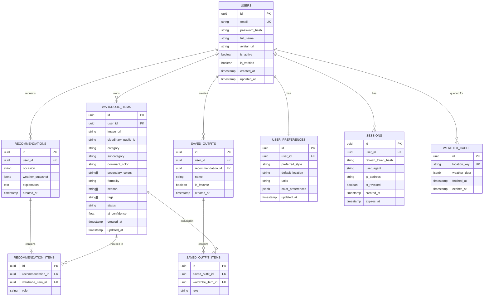

### 7.2 Table Definitions

#### 7.2.1 `users`

| Column | Type | Constraints |
|---|---|---|
| id | UUID | PK, default `gen_random_uuid()` |
| email | VARCHAR(255) | UNIQUE, NOT NULL, indexed |
| password_hash | VARCHAR(255) | NOT NULL |
| full_name | VARCHAR(150) | NULL |
| avatar_url | TEXT | NULL |
| is_active | BOOLEAN | DEFAULT true |
| is_verified | BOOLEAN | DEFAULT false |
| created_at | TIMESTAMPTZ | DEFAULT now() |
| updated_at | TIMESTAMPTZ | DEFAULT now(), on update trigger |

**Indexes:** `idx_users_email` (unique, btree on `email`).

#### 7.2.2 `user_preferences`

| Column | Type | Constraints |
|---|---|---|
| id | UUID | PK |
| user_id | UUID | FK → users.id, UNIQUE, ON DELETE CASCADE |
| preferred_style | VARCHAR(50) | NULL (e.g., "minimalist", "streetwear") |
| default_location | VARCHAR(150) | NULL |
| units | VARCHAR(10) | DEFAULT 'metric' |
| color_preferences | JSONB | DEFAULT '{}' |
| updated_at | TIMESTAMPTZ | DEFAULT now() |

#### 7.2.3 `wardrobe_items`

| Column | Type | Constraints |
|---|---|---|
| id | UUID | PK |
| user_id | UUID | FK → users.id, ON DELETE CASCADE, indexed |
| image_url | TEXT | NOT NULL |
| cloudinary_public_id | VARCHAR(255) | NOT NULL |
| category | VARCHAR(50) | indexed (e.g., "shirt", "trousers", "shoes", "jacket") |
| subcategory | VARCHAR(50) | NULL (e.g., "t-shirt", "formal-shirt") |
| dominant_color | VARCHAR(30) | indexed |
| secondary_colors | TEXT[] | DEFAULT '{}' |
| formality | VARCHAR(20) | indexed (e.g., "casual", "business", "formal", "athletic") |
| season | TEXT[] | DEFAULT '{}' (e.g., {"summer","spring"}) |
| tags | TEXT[] | DEFAULT '{}' |
| status | VARCHAR(20) | DEFAULT 'processing' ("processing","ready","needs_review","failed") |
| ai_confidence | FLOAT | NULL (0.0–1.0) |
| created_at | TIMESTAMPTZ | DEFAULT now() |
| updated_at | TIMESTAMPTZ | DEFAULT now() |

**Indexes:** `idx_wardrobe_user_id`, `idx_wardrobe_category`, `idx_wardrobe_color`, composite `idx_wardrobe_user_category (user_id, category)`.

#### 7.2.4 `recommendations`

| Column | Type | Constraints |
|---|---|---|
| id | UUID | PK |
| user_id | UUID | FK → users.id, ON DELETE CASCADE, indexed |
| occasion | VARCHAR(30) | NOT NULL |
| weather_snapshot | JSONB | NULL |
| explanation | TEXT | NULL |
| created_at | TIMESTAMPTZ | DEFAULT now() |

#### 7.2.5 `recommendation_items`

| Column | Type | Constraints |
|---|---|---|
| id | UUID | PK |
| recommendation_id | UUID | FK → recommendations.id, ON DELETE CASCADE |
| wardrobe_item_id | UUID | FK → wardrobe_items.id, ON DELETE CASCADE |
| role | VARCHAR(20) | e.g., "top","bottom","footwear","outerwear","accessory" |

#### 7.2.6 `saved_outfits`

| Column | Type | Constraints |
|---|---|---|
| id | UUID | PK |
| user_id | UUID | FK → users.id, ON DELETE CASCADE, indexed |
| recommendation_id | UUID | FK → recommendations.id, NULL allowed |
| name | VARCHAR(100) | NULL |
| is_favorite | BOOLEAN | DEFAULT false, indexed |
| created_at | TIMESTAMPTZ | DEFAULT now() |

#### 7.2.7 `saved_outfit_items`

| Column | Type | Constraints |
|---|---|---|
| id | UUID | PK |
| saved_outfit_id | UUID | FK → saved_outfits.id, ON DELETE CASCADE |
| wardrobe_item_id | UUID | FK → wardrobe_items.id, ON DELETE CASCADE |
| role | VARCHAR(20) | |

#### 7.2.8 `weather_cache`

| Column | Type | Constraints |
|---|---|---|
| id | UUID | PK |
| location_key | VARCHAR(150) | UNIQUE, indexed (e.g., "lat:23.34,lon:85.31") |
| weather_data | JSONB | NOT NULL |
| fetched_at | TIMESTAMPTZ | DEFAULT now() |
| expires_at | TIMESTAMPTZ | NOT NULL, indexed |

#### 7.2.9 `sessions`

| Column | Type | Constraints |
|---|---|---|
| id | UUID | PK |
| user_id | UUID | FK → users.id, ON DELETE CASCADE, indexed |
| refresh_token_hash | VARCHAR(255) | NOT NULL |
| user_agent | TEXT | NULL |
| ip_address | VARCHAR(45) | NULL |
| is_revoked | BOOLEAN | DEFAULT false |
| created_at | TIMESTAMPTZ | DEFAULT now() |
| expires_at | TIMESTAMPTZ | NOT NULL |

### 7.3 Relationships Summary

- One `user` → many `wardrobe_items` (1:N)
- One `user` → one `user_preferences` (1:1)
- One `user` → many `recommendations` (1:N)
- One `recommendation` → many `recommendation_items` (1:N); each `recommendation_item` references one `wardrobe_item`
- One `user` → many `saved_outfits` (1:N)
- One `saved_outfit` → many `saved_outfit_items` (1:N); each references one `wardrobe_item`
- `weather_cache` is independent, keyed by location, shared across users (not user-scoped) to maximize cache hit rate
- One `user` → many `sessions` (1:N), one per active device/refresh token

### 7.4 Migrations

- Managed via **Alembic**. Every schema change must ship with an up/down migration.
- Seed data script (`seed.py`) provided for local dev: creates a demo user with ~15 sample wardrobe items.

---
## 8. REST API Specification

**Base URL:** `/api/v1`
**Auth Scheme:** `Authorization: Bearer <access_token>` unless noted otherwise.
**Content-Type:** `application/json` unless uploading files (`multipart/form-data`).

All error responses follow this shape:

```json
{
  "error": {
    "code": "VALIDATION_ERROR",
    "message": "Human readable message",
    "details": [{"field": "email", "issue": "Invalid email format"}]
  }
}
```

### 8.1 Authentication Endpoints

#### `POST /api/v1/auth/signup`
- **Auth Required:** No
- **Request Body:**
```json
{"email": "user@example.com", "password": "Str0ngPass!", "full_name": "Jane Doe"}
```
- **Response 201:**
```json
{"user": {"id": "uuid", "email": "user@example.com", "full_name": "Jane Doe"}, "access_token": "jwt", "refresh_token": "jwt"}
```
- **Validation:** email format; password ≥8 chars, ≥1 letter, ≥1 number.
- **Errors:** `409` email exists; `422` validation failure.

#### `POST /api/v1/auth/login`
- **Auth Required:** No
- **Request Body:** `{"email": "user@example.com", "password": "Str0ngPass!"}`
- **Response 200:** `{"access_token": "jwt", "refresh_token": "jwt", "token_type": "bearer"}`
- **Errors:** `401` invalid credentials; `403` account inactive/unverified.

#### `POST /api/v1/auth/refresh`
- **Auth Required:** No (uses refresh token in body)
- **Request Body:** `{"refresh_token": "jwt"}`
- **Response 200:** `{"access_token": "jwt"}`
- **Errors:** `401` expired/invalid/revoked refresh token.

#### `POST /api/v1/auth/logout`
- **Auth Required:** Yes
- **Request Body:** `{"refresh_token": "jwt"}`
- **Response 204:** No content.
- **Effect:** Marks session `is_revoked=true`.

#### `GET /api/v1/auth/me`
- **Auth Required:** Yes
- **Response 200:** `{"id": "uuid", "email": "...", "full_name": "...", "avatar_url": "...", "is_verified": true}`

#### `PATCH /api/v1/auth/me`
- **Auth Required:** Yes
- **Request Body:** `{"full_name": "New Name", "avatar_url": "https://..."}`
- **Response 200:** Updated user object.
- **Errors:** `422` invalid fields.

### 8.2 Wardrobe Endpoints

#### `POST /api/v1/wardrobe/items`
- **Auth Required:** Yes
- **Request:** `multipart/form-data` with `image` file field (JPEG/PNG/WEBP, ≤10MB).
- **Response 202 (Accepted):**
```json
{"id": "uuid", "status": "processing", "image_url": "https://res.cloudinary.com/..."}
```
- **Effect:** Uploads to Cloudinary, creates DB row `status=processing`, enqueues AI analysis task.
- **Errors:** `413` file too large; `415` unsupported media type; `422` missing file.

#### `GET /api/v1/wardrobe/items`
- **Auth Required:** Yes
- **Query Params:** `category`, `color`, `season`, `formality`, `search`, `page` (default 1), `page_size` (default 20, max 100)
- **Response 200:**
```json
{"items": [ {"id": "uuid", "image_url": "...", "category": "shirt", "dominant_color": "blue", "formality": "casual", "season": ["summer"], "tags": ["cotton","short-sleeve"], "status": "ready"} ], "total": 42, "page": 1, "page_size": 20}
```

#### `GET /api/v1/wardrobe/items/{item_id}`
- **Auth Required:** Yes
- **Response 200:** Full item object.
- **Errors:** `404` not found or not owned by user.

#### `PATCH /api/v1/wardrobe/items/{item_id}`
- **Auth Required:** Yes
- **Request Body:** Any subset of `{"category", "subcategory", "dominant_color", "secondary_colors", "formality", "season", "tags"}`
- **Response 200:** Updated item.
- **Use Case:** Manual override of AI tags (WARD-08).

#### `DELETE /api/v1/wardrobe/items/{item_id}`
- **Auth Required:** Yes
- **Response 204:** No content.
- **Effect:** Deletes DB row and Cloudinary asset; cascades to `recommendation_items`/`saved_outfit_items` (item reference removed or outfit marked incomplete).

### 8.3 AI Analysis Endpoints (internal/service-triggered, also exposed for retry)

#### `POST /api/v1/wardrobe/items/{item_id}/reanalyze`
- **Auth Required:** Yes
- **Response 202:** `{"id": "uuid", "status": "processing"}`
- **Use Case:** Retry AI analysis if it previously failed (`status=needs_review`/`failed`).

### 8.4 Weather Endpoints

#### `GET /api/v1/weather/current`
- **Auth Required:** Yes
- **Query Params:** `lat`, `lon` OR `location` (city name); falls back to `user_preferences.default_location`.
- **Response 200:**
```json
{"location": "Ranchi, IN", "temp_c": 29.4, "condition": "Clouds", "humidity": 68, "wind_kph": 12.1, "cached": true, "fetched_at": "2026-08-15T09:00:00Z"}
```
- **Errors:** `400` no location resolvable; `502` upstream weather API failure (falls back to last cached entry with `stale: true` flag if available).

### 8.5 Recommendation Endpoints

#### `POST /api/v1/recommendations`
- **Auth Required:** Yes
- **Request Body:**
```json
{"occasion": "office", "location": "Ranchi, IN", "count": 3}
```
- **Response 201:**
```json
{
  "recommendation_id": "uuid",
  "occasion": "office",
  "weather_snapshot": {"temp_c": 29.4, "condition": "Clouds"},
  "outfits": [
    {
      "items": [
        {"wardrobe_item_id": "uuid", "role": "top"},
        {"wardrobe_item_id": "uuid", "role": "bottom"},
        {"wardrobe_item_id": "uuid", "role": "footwear"}
      ],
      "score": 0.91,
      "explanation": "Neutral blue shirt pairs well with grey trousers for a business-casual office look suited to warm, cloudy weather."
    }
  ]
}
```
- **Validation:** `occasion` must be one of the seven supported presets; `count` 1–5.
- **Errors:** `422` invalid occasion; `409` insufficient wardrobe items to form an outfit (returns partial suggestions + message).

#### `GET /api/v1/recommendations/{recommendation_id}`
- **Auth Required:** Yes
- **Response 200:** Full recommendation with item details expanded.

### 8.6 Saved Outfits Endpoints

#### `POST /api/v1/outfits`
- **Auth Required:** Yes
- **Request Body:** `{"recommendation_id": "uuid", "name": "Monday Office Look", "wardrobe_item_ids": ["uuid1","uuid2"]}`
- **Response 201:** Created outfit object.

#### `GET /api/v1/outfits`
- **Auth Required:** Yes
- **Query Params:** `is_favorite` (bool), `page`, `page_size`
- **Response 200:** Paginated list of saved outfits with expanded item thumbnails.

#### `PATCH /api/v1/outfits/{outfit_id}`
- **Auth Required:** Yes
- **Request Body:** `{"name": "New Name", "is_favorite": true}`
- **Response 200:** Updated outfit.

#### `DELETE /api/v1/outfits/{outfit_id}`
- **Auth Required:** Yes
- **Response 204**

### 8.7 Dashboard Endpoints

#### `GET /api/v1/dashboard/stats`
- **Auth Required:** Yes
- **Response 200:**
```json
{
  "total_items": 42,
  "by_category": {"shirt": 12, "trousers": 8, "shoes": 5},
  "by_color": {"blue": 10, "black": 15},
  "favorite_categories": ["shirt", "shoes"],
  "recent_uploads": [{"id": "uuid", "image_url": "...", "created_at": "2026-08-14T10:00:00Z"}],
  "total_saved_outfits": 9,
  "total_favorites": 3
}
```

### 8.8 Standard Status Codes Used

| Code | Meaning |
|---|---|
| 200 | Success (GET/PATCH) |
| 201 | Resource created |
| 202 | Accepted (async processing started) |
| 204 | Success, no content (DELETE/logout) |
| 400 | Bad request |
| 401 | Unauthorized / invalid token |
| 403 | Forbidden (inactive/unverified account) |
| 404 | Not found / not owned |
| 409 | Conflict (duplicate, insufficient data) |
| 413 | Payload too large |
| 415 | Unsupported media type |
| 422 | Validation error |
| 429 | Rate limit exceeded |
| 502 | Upstream service failure |
| 500 | Internal server error |

---
## 9. AI Module Design

### 9.1 Overview

The AI module is responsible for converting a raw clothing photo into structured metadata that powers search, filtering, and recommendations.

### 9.2 Processing Pipeline

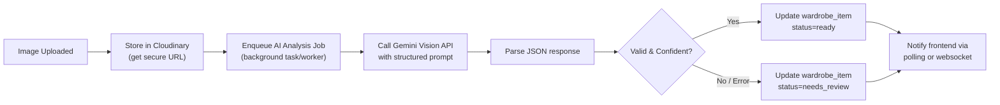

### 9.3 Extracted Metadata Schema

The AI is prompted to return strictly structured JSON:

```json
{
  "category": "shirt",
  "subcategory": "formal-shirt",
  "dominant_color": "light-blue",
  "secondary_colors": ["white"],
  "formality": "business",
  "season": ["spring", "summer", "autumn"],
  "tags": ["cotton", "long-sleeve", "collared"],
  "confidence": 0.88
}
```

**Field Constraints:**
- `category` — enum: `shirt, t-shirt, trousers, jeans, shorts, jacket, dress, skirt, sweater, shoes, sneakers, accessory, other`
- `formality` — enum: `casual, business, formal, athletic`
- `season` — subset of `{spring, summer, autumn, winter}`
- `confidence` — float 0.0–1.0; if `< 0.5`, item is flagged `needs_review` even if the call succeeded.

### 9.4 Explaining Recommendations

When generating an outfit, the recommendation engine also asks the AI (or applies templated rule-based text if AI is unavailable) to produce a 1–2 sentence human-readable explanation referencing: weather condition, occasion, and why the specific color/style combination works. This is stored in `recommendations.explanation`.

### 9.5 AI Failure Handling & Fallback Strategy

| Failure Type | Handling |
|---|---|
| API timeout (>8s) | Retry once with 2s backoff; on second failure, mark `needs_review` |
| API error (4xx/5xx) | Log error, mark `needs_review`, notify user to manually tag |
| Malformed JSON response | Attempt lenient re-parse (strip markdown fences); on failure, mark `needs_review` |
| Low confidence (<0.5) | Save best-guess metadata but flag `needs_review` for user confirmation |
| Rate limit hit | Queue job for retry with exponential backoff (max 3 attempts); surface "processing may take longer" to user |
| Total AI outage | Recommendation engine falls back to **rule-based only** mode using existing tagged items; untagged items excluded from auto-recommendations until manually tagged |

**Design Principle:** The AI is an *enhancement*, not a hard dependency for core CRUD — users can always manually tag/edit clothing items regardless of AI availability.

---

## 10. Weather Integration

### 10.1 Flow

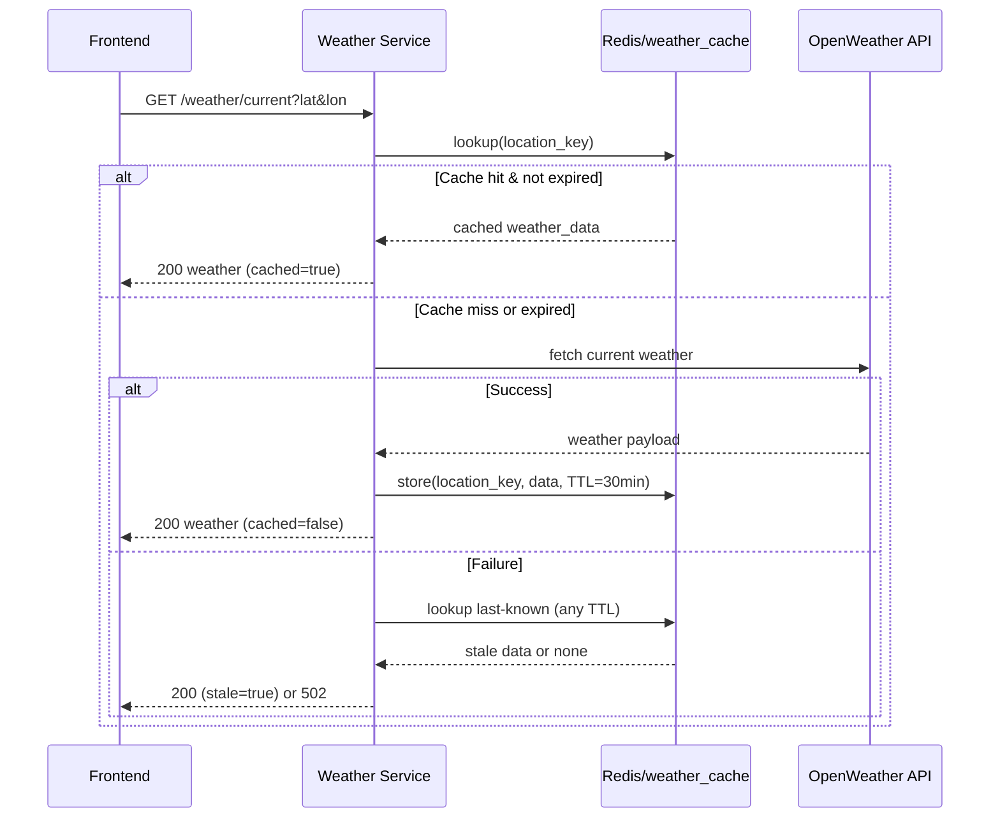

### 10.2 Caching Rules

- **Cache key:** rounded lat/lon to 2 decimal places (~1.1km precision) or normalized city name.
- **TTL:** 30 minutes (configurable via `WEATHER_CACHE_TTL_SECONDS`).
- **Storage:** Redis primary; `weather_cache` Postgres table as durable fallback/audit trail.

### 10.3 Weather-to-Outfit Mapping Rules (Rule-Based Layer)

| Temp Range (°C) | Suggested Layer Guidance |
|---|---|
| < 10 | Heavy outerwear, sweaters, closed shoes |
| 10–18 | Light jacket or sweater |
| 18–25 | Standard single-layer clothing |
| 25–32 | Breathable fabrics, short sleeves |
| > 32 | Lightest fabrics, avoid dark colors, shorts/light dresses |

Rain/snow conditions exclude suede/delicate-material tags (post-MVP tag enrichment 🟢) and deprioritize open sandals for `rain` condition (🟡).

---

## 11. Recommendation Engine

### 11.1 Scoring Model

For each candidate outfit combination (top + bottom + footwear [+ outerwear/accessory]), compute a composite score:

```
score = (0.35 * weather_fit) + (0.25 * occasion_fit) + (0.25 * color_harmony) + (0.15 * style_consistency)
```

- **weather_fit:** 1.0 if item `season` list contains current season derived from temperature/condition; partial credit (0.5) if adjacent season; 0 otherwise.
- **occasion_fit:** 1.0 if item `formality` matches the occasion's required formality band (see table below); graded penalty otherwise.
- **color_harmony:** derived from a color-wheel complementary/analogous/neutral matching table; neutrals (black/white/grey/navy/beige) always score ≥0.7 with anything.
- **style_consistency:** bonus if items share `tags` overlap or same `preferred_style` from `user_preferences`.

### 11.2 Occasion → Formality Mapping

| Occasion | Required Formality Band |
|---|---|
| College | casual, business (light) |
| Office | business |
| Party | casual (trendy), business |
| Interview | formal, business |
| Wedding | formal |
| Gym | athletic |
| Casual | casual |

### 11.3 Generation Algorithm (Pseudocode)

```
function generate_outfits(user_id, occasion, weather, count):
    items = fetch_ready_wardrobe_items(user_id)
    candidates = []
    for top in items where role_candidate(top) in [top, dress]:
        for bottom in items where role_candidate(bottom) == bottom (skip if top is dress):
            for shoe in items where role_candidate(shoe) == footwear:
                combo = [top, bottom, shoe]
                if optional outerwear needed by weather_fit(weather) < threshold:
                    combo += best_matching_outerwear(items, top)
                score = compute_score(combo, occasion, weather)
                candidates.append((combo, score))
    top_n = sort_desc(candidates, by=score)[:count]
    for outfit in top_n:
        outfit.explanation = generate_explanation(outfit, occasion, weather) # AI or template
    return top_n
```

**Performance Note:** For wardrobes up to ~300 items, a naive combinatorial search with early pruning (filter by formality/season before nested loop) is acceptable for MVP (target: <500ms p95 server-side compute, excluding AI explanation call). Beyond that, precomputed compatibility indices are a v2 optimization (🟡).

### 11.4 Insufficient Wardrobe Handling

If fewer than one item exists for a required role (e.g., no footwear tagged), return `409` with:
```json
{"error": {"code": "INSUFFICIENT_WARDROBE", "message": "You need at least one item tagged as footwear to generate a complete outfit.", "missing_roles": ["footwear"]}}
```

---

## 12. User Flows

### 12.1 Registration Flow

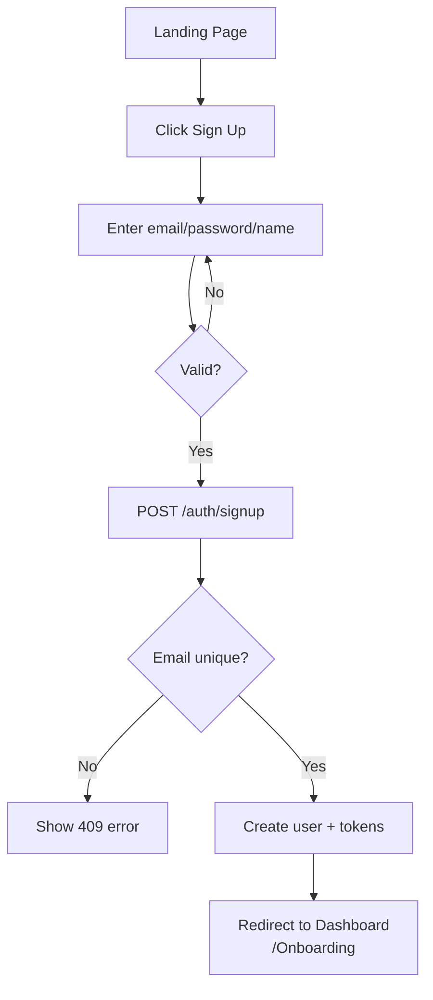

### 12.2 Login Flow

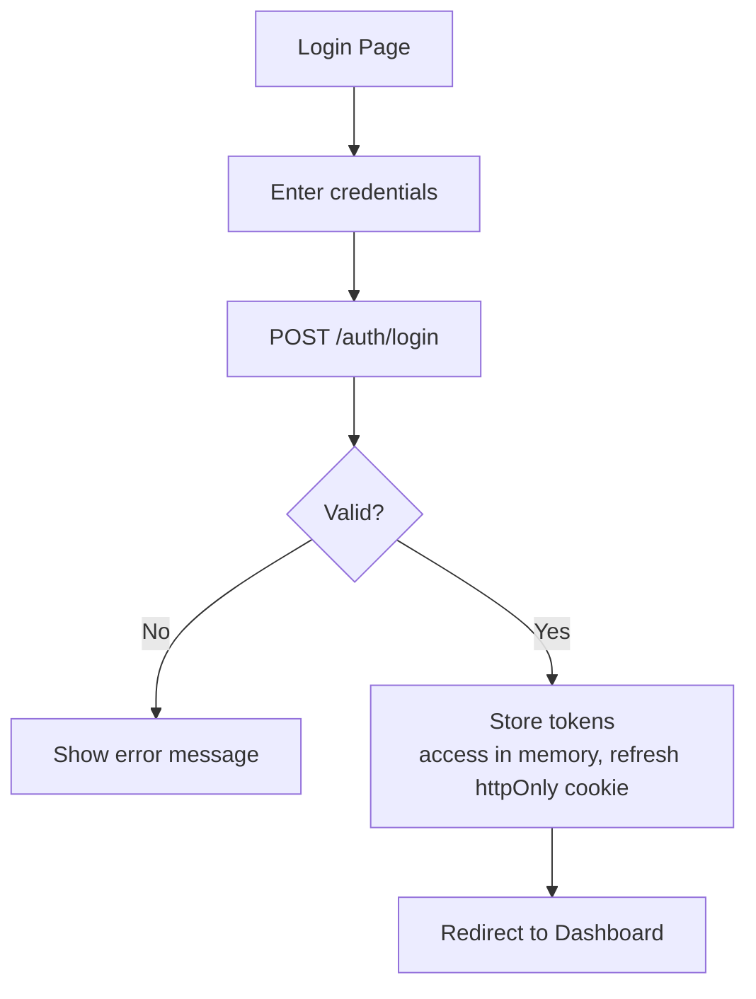

### 12.3 Uploading Clothes Flow

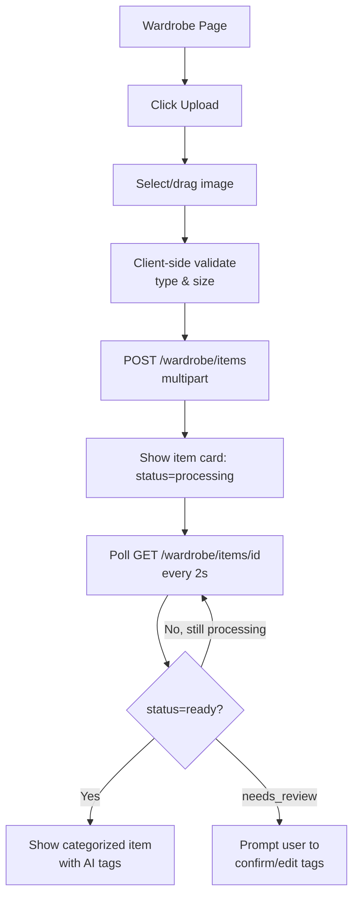

### 12.4 Getting Recommendations Flow

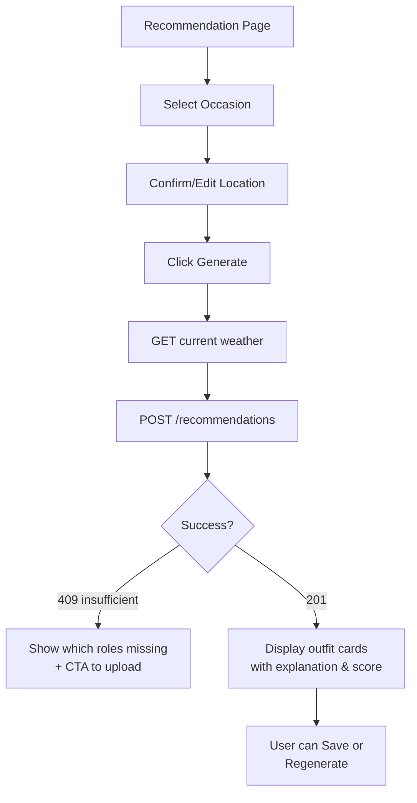

### 12.5 Saving Outfits Flow

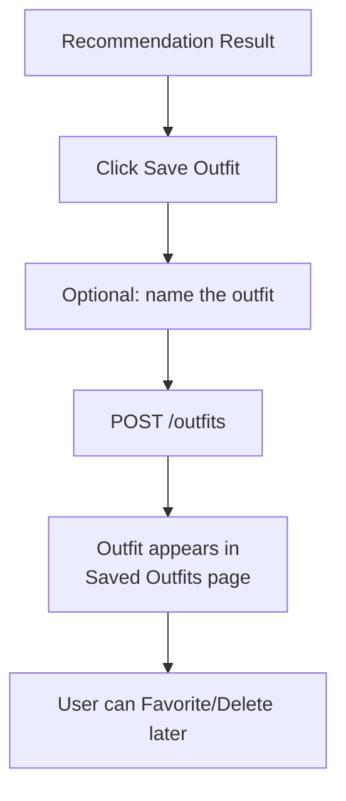

### 12.6 Updating Profile Flow

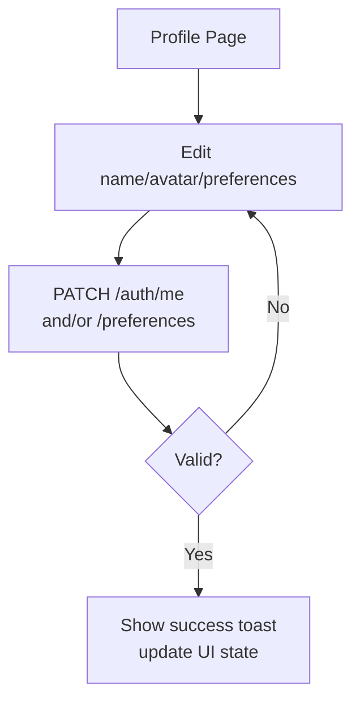

### 12.7 Deleting Clothes Flow

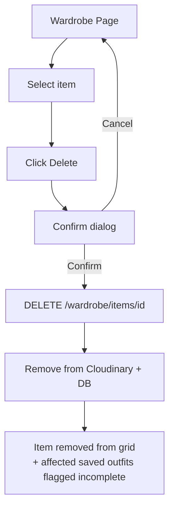

---
## 13. UI/UX Requirements

### 13.1 Landing Page (`/`)
**Purpose:** Marketing/entry point for unauthenticated users.
**Components:** Navbar (logo, Login, Sign Up CTA), Hero section (headline, subheadline, CTA button, hero illustration), "How it works" 3-step section, feature highlight cards (AI categorization, weather-aware, color matching), testimonials/social proof placeholder, footer (links, copyright).
**Priority:** 🔴

### 13.2 Authentication Pages (`/login`, `/signup`, `/forgot-password`)
**Components:** Centered auth card, email input, password input (with show/hide toggle), submit button, link to switch between login/signup, inline validation error messages, loading spinner on submit, OAuth button placeholder (🟢 v2).
**Priority:** 🔴 (forgot-password 🟡)

### 13.3 Dashboard (`/dashboard`)
**Components:** Top navbar with user avatar dropdown, sidebar navigation (Dashboard, Wardrobe, Recommendations, Saved Outfits, Profile), stat cards (Total Items, Saved Outfits, Favorites), category distribution chart (pie/bar), recent uploads horizontal scroll strip, quick-action buttons ("Upload Clothes", "Get Recommendation").
**Priority:** 🔴

### 13.4 Wardrobe Page (`/wardrobe`)
**Components:** Search bar, filter dropdowns (category, color, season, formality), grid of clothing cards (image thumbnail, category label, color swatch, status badge), "Upload" floating action button, empty-state illustration + CTA when wardrobe is empty, pagination/infinite scroll.
**Priority:** 🔴

### 13.5 Upload Page/Modal (`/wardrobe/upload`)
**Components:** Drag-and-drop zone, file picker button, image preview thumbnail(s), upload progress bar, processing status indicator (spinner → "Analyzing with AI..." → result), editable AI-suggested tag chips post-analysis, Save/Cancel buttons.
**Priority:** 🔴

### 13.6 Recommendation Page (`/recommendations`)
**Components:** Occasion selector (7 preset chips/cards), location display with edit/override control, current weather summary widget (icon, temp, condition), "Generate Outfit" primary button, result cards carousel (each showing outfit item thumbnails, match score badge, AI explanation text, Save/Regenerate buttons), loading skeleton during generation, insufficient-wardrobe empty state with CTA to upload missing category.
**Priority:** 🔴

### 13.7 Saved Outfits Page (`/outfits`)
**Components:** Tab/filter (All / Favorites), grid of outfit cards (composite thumbnail of items, name, date saved, favorite star toggle, delete icon), empty state.
**Priority:** 🔴

### 13.8 Profile Page (`/profile`)
**Components:** Avatar upload/change, editable full name field, email (read-only), preferences section (preferred style selector, default location input, units toggle metric/imperial), change password link, logout button, danger zone (delete account — 🟡 v1.1).
**Priority:** 🔴

### 13.9 Global Components

| Component | Used On | Notes |
|---|---|---|
| Navbar | All authenticated pages | Responsive collapse to hamburger menu on mobile |
| Sidebar | Dashboard-layout pages | Collapsible on tablet/mobile |
| Toast/Notification | Global | Success/error/info variants |
| Modal/Dialog | Confirm delete, upload | Accessible (focus trap, ESC to close) |
| Loading Skeletons | Wardrobe grid, recommendation cards | Avoid layout shift |
| Empty States | Wardrobe, Saved Outfits | Friendly illustration + CTA |

### 13.10 Responsiveness

- Breakpoints: `sm` 360–639px, `md` 640–1023px, `lg` 1024px+.
- Grid layouts collapse from 4 → 2 → 1 columns across breakpoints.
- Touch targets ≥44px on mobile.

### 13.11 Accessibility

- WCAG 2.1 AA target: color contrast ≥4.5:1 for text, all interactive elements keyboard-navigable, semantic HTML landmarks, `alt` text for all clothing images (auto-generated from category/color, e.g., "Blue casual shirt"), ARIA labels on icon-only buttons.

---

## 14. Non-Functional Requirements

| Category | Requirement | Target/Metric |
|---|---|---|
| Performance | API response time (non-AI endpoints) | p95 < 300ms |
| Performance | Recommendation generation (excl. external AI call) | p95 < 500ms |
| Performance | Image upload acknowledgment | < 2s to return `202` |
| Scalability | Concurrent users (MVP target) | 1,000 concurrent, horizontally scalable stateless API pods |
| Scalability | Database connection pooling | PgBouncer or SQLAlchemy pool (size configurable) |
| Availability | Uptime target | 99.5% (MVP), 99.9% (post-scale) |
| Reliability | Graceful degradation | AI/weather outages degrade features, do not crash core app |
| Maintainability | Code coverage minimum | ≥70% backend unit test coverage |
| Maintainability | Linting | ESLint/Prettier (FE), Ruff/Black (BE), enforced in CI |
| Logging | Structured JSON logs | Correlation/request ID on every log line |
| Monitoring | Error tracking | Sentry integration; alert on error rate spike |
| Monitoring | Uptime checks | Health check endpoint `/health` polled every 60s |
| Security | See [Section 15](#15-security-requirements) | — |
| Accessibility | WCAG 2.1 AA | See 13.11 |
| Responsiveness | Mobile-first support | 360px–2560px viewport range |
| Data Retention | Soft-delete grace period for deleted items (post-MVP) | 30 days (🟢) |
| Cost Control | AI/weather API call caching | ≥80% cache hit rate target for weather |

---

## 15. Security Requirements

### 15.1 Authentication & Authorization
- **JWT Authentication:** Short-lived access tokens (15 min) signed with `HS256`/`RS256`; refresh tokens (7 days) stored hashed in `sessions` table, rotated on use.
- **Password Hashing:** `bcrypt` (cost factor ≥12) or `argon2id`. Plaintext passwords never logged or stored.
- **Authorization:** Every wardrobe/recommendation/outfit resource lookup filters by `user_id` derived from the JWT — never trust a client-supplied user ID. Return `404` (not `403`) for resources belonging to another user to avoid resource enumeration.

### 15.2 Input Validation
- All request bodies validated via Pydantic schemas with strict types, length limits, and enum constraints.
- File uploads validated by MIME type sniffing (not just extension) and size limits (≤10MB).

### 15.3 Rate Limiting
- Per-IP and per-user rate limits via Redis-backed middleware (e.g., `slowapi`): auth endpoints 5 req/min/IP; general API 100 req/min/user; AI-triggering endpoints (upload, recommendations) 20 req/min/user.
- `429` returned with `Retry-After` header on breach.

### 15.4 CORS
- Explicit allow-list of frontend origins (from `ALLOWED_ORIGINS` env var); no wildcard `*` in production; credentials allowed only for whitelisted origins.

### 15.5 SQL Injection Prevention
- Exclusively parameterized queries via SQLAlchemy ORM/Core; no raw string interpolation into SQL.

### 15.6 XSS Prevention
- React's default JSX escaping relied upon; no `dangerouslySetInnerHTML` for user-generated content; sanitize any rich text fields (e.g., outfit names) server-side before storage if HTML rendering is ever introduced.

### 15.7 CSRF Considerations
- Access tokens sent via `Authorization` header (not cookies) to avoid classic CSRF vectors. If refresh token is stored in an httpOnly cookie, it is scoped `SameSite=Strict` and CSRF token double-submit pattern is applied for cookie-based refresh calls.

### 15.8 Secrets Management
- All API keys (Cloudinary, OpenWeather, Gemini, JWT signing key, DB credentials) stored in environment variables / secret manager (GitHub Actions secrets, Render/AWS secret store) — never committed to source control. `.env.example` provided without real values.

### 15.9 Additional Hardening
- HTTPS enforced everywhere (HSTS header).
- Security headers via middleware: `X-Content-Type-Options`, `X-Frame-Options`, `Content-Security-Policy` (baseline).
- Dependency vulnerability scanning in CI (`pip-audit`, `npm audit`).

---
## 16. Testing Strategy

| Type | Scope | Tooling | Target Coverage |
|---|---|---|---|
| Unit Testing (BE) | Services, repositories, scoring/recommendation logic | Pytest | ≥70% |
| Unit Testing (FE) | Components, hooks, utility functions | Jest + React Testing Library | ≥60% |
| Integration Testing (BE) | API endpoints against a test DB (transactional rollback per test) | Pytest + httpx AsyncClient | All endpoints covered by ≥1 happy path + ≥1 error path |
| API Testing | Contract validation against OpenAPI schema | Schemathesis (optional 🟡) | Critical endpoints |
| Frontend Testing | Page rendering, form validation, state updates | Jest + RTL | Key pages (auth, wardrobe, recommendations) |
| End-to-End Testing | Full user journeys (signup → upload → recommend → save) | Playwright | 3 critical-path scenarios minimum |
| AI Module Testing | Mocked Gemini responses (success, malformed, timeout) | Pytest with mocked HTTP client | All fallback branches from 9.5 |
| Load Testing | Baseline throughput under target concurrency | k6 or Locust (🟡, pre-launch) | 1,000 concurrent virtual users |

**CI Gate:** All PRs must pass lint + unit + integration tests before merge (GitHub Actions required check).

---

## 17. Deployment & DevOps

### 17.1 Containerization

- Separate `Dockerfile` for frontend (Next.js standalone build) and backend (FastAPI + Uvicorn/Gunicorn workers).
- `docker-compose.yml` for local development: `frontend`, `backend`, `postgres`, `redis` services with hot-reload volumes.

### 17.2 CI/CD Pipeline (GitHub Actions)

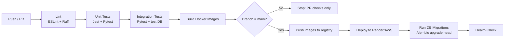

### 17.3 Environments

| Environment | Purpose | Deployment Trigger |
|---|---|---|
| Local | Development | `docker-compose up` |
| Staging | Pre-prod validation | Merge to `develop` branch |
| Production | Live users | Merge to `main` branch, manual approval gate |

### 17.4 Production Configuration Notes

- Backend served via Gunicorn with Uvicorn workers (`-w 4 -k uvicorn.workers.UvicornWorker`), behind a reverse proxy (Render's built-in / AWS ALB).
- Frontend deployed as Next.js standalone output or via Vercel-compatible adapter if hosted separately.
- Database migrations run automatically as a pre-deploy step (`alembic upgrade head`), never manually against production.
- Zero-downtime deploys via rolling restart (health check must pass before old instance is terminated).

---

## 18. Folder Structure

### 18.1 Backend (`/backend`)

```
backend/
├── app/
│   ├── main.py                  # FastAPI app entrypoint
│   ├── config.py                # Settings via pydantic-settings
│   ├── api/
│   │   └── v1/
│   │       ├── routers/
│   │       │   ├── auth.py
│   │       │   ├── wardrobe.py
│   │       │   ├── weather.py
│   │       │   ├── recommendations.py
│   │       │   ├── outfits.py
│   │       │   └── dashboard.py
│   │       └── deps.py          # shared dependencies (get_current_user, get_db)
│   ├── services/
│   │   ├── auth_service.py
│   │   ├── wardrobe_service.py
│   │   ├── ai_service.py
│   │   ├── weather_service.py
│   │   ├── recommendation_service.py
│   │   └── outfit_service.py
│   ├── repositories/
│   │   ├── user_repository.py
│   │   ├── wardrobe_repository.py
│   │   ├── recommendation_repository.py
│   │   └── outfit_repository.py
│   ├── models/                  # SQLAlchemy ORM models
│   ├── schemas/                 # Pydantic request/response DTOs
│   ├── core/
│   │   ├── security.py          # JWT + password hashing
│   │   ├── logging.py
│   │   └── exceptions.py
│   ├── integrations/
│   │   ├── cloudinary_client.py
│   │   ├── openweather_client.py
│   │   └── gemini_client.py
│   └── db/
│       ├── session.py
│       └── migrations/          # Alembic
├── tests/
│   ├── unit/
│   └── integration/
├── Dockerfile
├── requirements.txt
└── alembic.ini
```

### 18.2 Frontend (`/frontend`)

```
frontend/
├── app/
│   ├── (auth)/
│   │   ├── login/page.tsx
│   │   └── signup/page.tsx
│   ├── dashboard/page.tsx
│   ├── wardrobe/
│   │   ├── page.tsx
│   │   └── upload/page.tsx
│   ├── recommendations/page.tsx
│   ├── outfits/page.tsx
│   ├── profile/page.tsx
│   └── layout.tsx
├── components/
│   ├── ui/                      # shared primitives (Button, Card, Modal, Toast)
│   ├── wardrobe/
│   ├── recommendations/
│   └── layout/                  # Navbar, Sidebar
├── hooks/
│   ├── useAuth.ts
│   ├── useWardrobe.ts
│   └── useRecommendations.ts
├── lib/
│   ├── apiClient.ts
│   └── types.ts
├── store/                       # Zustand stores
├── public/
├── Dockerfile
├── tailwind.config.ts
└── package.json
```

---

## 19. Configuration & Environment Variables

| Variable | Component | Description |
|---|---|---|
| `DATABASE_URL` | Backend | PostgreSQL connection string |
| `REDIS_URL` | Backend | Redis connection string |
| `JWT_SECRET_KEY` | Backend | Signing secret for JWTs |
| `JWT_ALGORITHM` | Backend | e.g., `HS256` |
| `ACCESS_TOKEN_EXPIRE_MINUTES` | Backend | Default `15` |
| `REFRESH_TOKEN_EXPIRE_DAYS` | Backend | Default `7` |
| `CLOUDINARY_CLOUD_NAME` | Backend | Cloudinary config |
| `CLOUDINARY_API_KEY` | Backend | Cloudinary config |
| `CLOUDINARY_API_SECRET` | Backend | Cloudinary config |
| `OPENWEATHER_API_KEY` | Backend | OpenWeather API key |
| `WEATHER_CACHE_TTL_SECONDS` | Backend | Default `1800` |
| `GEMINI_API_KEY` | Backend | AI vision API key |
| `ALLOWED_ORIGINS` | Backend | Comma-separated CORS allow-list |
| `SENTRY_DSN` | Backend/Frontend | Error tracking |
| `NEXT_PUBLIC_API_BASE_URL` | Frontend | Backend API base URL |

All variables documented in `.env.example` at the root of each project with placeholder (non-secret) values.

---

## 20. Future Roadmap

### 20.1 Version 2

| Feature | Priority |
|---|---|
| OAuth login (Google) | 🟡 |
| Email verification & password reset | 🟡 |
| Precomputed compatibility index for large wardrobes | 🟡 |
| OpenAPI-generated typed frontend client | 🟡 |
| Push/email notifications ("Rain expected — here's a weatherproof outfit") | 🟢 |
| Multi-region deployment | 🟢 |

### 20.2 Version 3

| Feature | Priority |
|---|---|
| Virtual Try-On (AR/image compositing) | 🟢 |
| Body Measurement Profile | 🟢 |
| Skin Tone Detection for color recommendations | 🟢 |
| Fashion Trend Prediction (seasonal trend ingestion) | 🟢 |
| Native Mobile App (React Native) | 🟢 |

### 20.3 Long-Term Vision

- Affiliate Shopping integration (recommend purchasable items to fill wardrobe gaps).
- Subscription tiers (free vs. premium AI stylist features).
- Social sharing of outfits / community style boards.
- Multi-language support (i18n).
- B2B licensing for fashion retailers (personalization widget).

---

## 21. Acceptance Criteria Summary

The MVP is considered **launch-ready** when all of the following are true:

1. ✅ A new user can sign up, log in, and remain authenticated across sessions via JWT refresh.
2. ✅ A user can upload a clothing image and see it auto-categorized within 10 seconds (p95), or flagged for manual review on AI failure.
3. ✅ A user can search and filter their wardrobe by category, color, season, and formality.
4. ✅ A user can select an occasion and receive at least one complete, weather-appropriate outfit recommendation with an explanation, given a sufficiently stocked wardrobe.
5. ✅ A user can save, favorite, and delete outfit recommendations, and view history.
6. ✅ The dashboard accurately reflects wardrobe statistics in real time (or near-real-time, ≤5s staleness).
7. ✅ All 🔴 Must Have features from Sections 6.1–6.7 are implemented and covered by integration tests.
8. ✅ Security requirements in Section 15 are implemented (JWT, hashing, rate limiting, CORS, input validation).
9. ✅ The application is containerized and deployable via the documented CI/CD pipeline to a staging environment.
10. ✅ Core user flows (Section 12) pass end-to-end Playwright tests.

---

## 22. Appendix

### 22.1 Sample `wardrobe_items` API Response (Full Object)

```json
{
  "id": "6f1d2a3e-...-...",
  "user_id": "3c2b1a0d-...-...",
  "image_url": "https://res.cloudinary.com/outfitai/image/upload/v1/wardrobe/abc123.jpg",
  "category": "shirt",
  "subcategory": "formal-shirt",
  "dominant_color": "light-blue",
  "secondary_colors": ["white"],
  "formality": "business",
  "season": ["spring", "summer", "autumn"],
  "tags": ["cotton", "long-sleeve", "collared"],
  "status": "ready",
  "ai_confidence": 0.88,
  "created_at": "2026-08-10T08:12:00Z",
  "updated_at": "2026-08-10T08:12:04Z"
}
```

### 22.2 Occasion Enum

```
["college", "office", "party", "interview", "wedding", "gym", "casual"]
```

### 22.3 Category Enum

```
["shirt", "t-shirt", "trousers", "jeans", "shorts", "jacket", "dress", "skirt", "sweater", "shoes", "sneakers", "accessory", "other"]
```

### 22.4 Formality Enum

```
["casual", "business", "formal", "athletic"]
```

### 22.5 Season Enum

```
["spring", "summer", "autumn", "winter"]
```

### 22.6 Revision History

| Version | Date | Change |
|---|---|---|
| 1.0 | 2026-08-15 | Initial complete SRS for MVP implementation |

---

*End of Software Requirements Specification — Outfit.ai v1.0*
